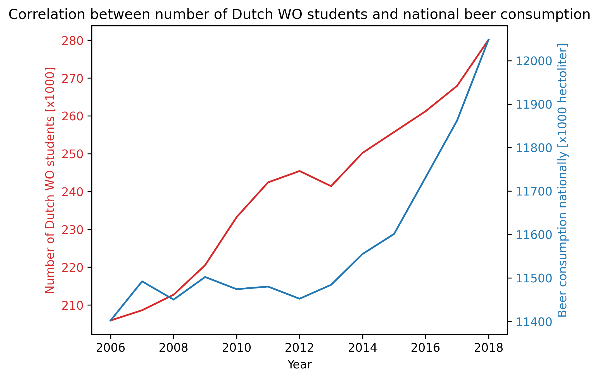

# Assignment 1 Practical Skills: Tools for Computational Scientists


Student ID: 13995081


## Paper Titles and Relevant Information:
1. Fantastic yeasts and where to find them: the hidden diversity of dimorphic fungal pathogens.
   (Van Dyke MCC, Teixeira MM, Barker BM. Curr Opin Microbiol. 2019 Dec;52:55-63. doi: 10.1016/j.mib.2019.05.002. Epub 2019 Jun 7. PMID: 31181385; PMCID: PMC11227906)

2. An analysis of the forces required to drag sheep over various surfaces
    (J.T Harvey, J Culvenor, W Payne, S Cowley, M Lawrance, D Stuart, R Williams, Applied Ergonomics, Volume 33, Issue 6, 2002, Pages 523-531, ISSN 0003-6870, https://doi.org/10.1016/S0003-6870(02)00071-6)

3. The neurocognitive effects of alcohol on adolescents and college students.
    (Zeigler DW, Wang CC, Yoast RA, Dickinson BD, McCaffree MA, Robinowitz CB, Sterling ML; Council on Scientific Affairs, American Medical Association. Prev Med. 2005 Jan;40(1):23-32. doi: 10.1016/j.ypmed.2004.04.044. PMID: 15530577)

## Plotting Code
```python
import matplotlib.pyplot as plt

with open("istherecorrelation.csv") as f:
    lines = [line.strip().split(";") for line in f.readlines()[1:]]
    x = [int(line[0]) for line in lines]
    y = [float(line[1].replace(",", ".")) for line in lines]
    z = [float(line[2]) for line in lines]

    fig, ax1 = plt.subplots()

    color = ['tab:red', 'tab:blue']
    ax1.set_xlabel('Year')
    ax1.set_ylabel('Number of Dutch WO students [x1000]', color=color[0])
    ax1.plot(x, y, color=color[0])
    ax1.tick_params(axis='y', labelcolor=color[0])

    ax2 = ax1.twinx()
    ax2.set_ylabel('Beer consumption nationally [x1000 hectoliter]', color=color[1])
    ax2.plot(x, z, color=color[1])
    ax2.tick_params(axis='y', labelcolor=color[1])

    plt.title("Possible correlation between number of Dutch WO students and national beer consumption")
    plt.savefig("istherecorrelation.png")
    plt.show()
```

## Result and Interpretation
The above code produces the plot seen below. It seems that the data indicates a strong correlation between the number of WO students and beer consumption in the Netherlands, however there are some caveats to this conclusion. The given csv file only has data for a span of 12 years (2006-2018), leaving out possible inverse correlatory data that would disprove this conclusion.


